# Bid whisperer

One day inside a real-time bidding log: what drives a click, and what it costs to win.

<p align="center">
  <strong><a href="https://eforus-overseer.github.io/bid-whisperer/">Read the interactive report →</a></strong><br>
  <sub>The findings as an illustrated data story with interactive Plotly charts.</sub>
</p>

<p align="center">
  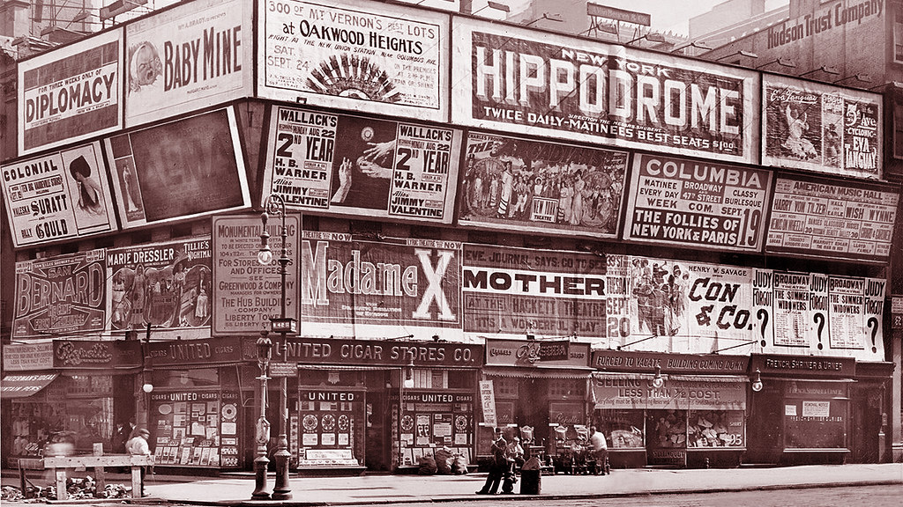
</p>
<p align="center"><sub>Times Square, 1910. Ad slots were auctioned then too, just more slowly. Photo: JFGryphon, CC0 1.0 (<a href="reports/images/CREDITS.md">credits</a>).</sub></p>

<p align="center">
  
</p>
<p align="center"><sub>Every screen is an ad slot, every passer-by an impression. Photo by Ayman Bardi on Pexels.</sub></p>

A programmatic ad exchange auctions each ad slot in a few milliseconds. This
repository takes one day of US bid-request logs from a take-home assignment
(249,232 impressions, 26 columns, 2021-02-01) and answers the three questions the
brief asks, then keeps going: two machine-learning models, seven extra analysis
layers, and an attempt to reverse the hashed identifiers.

The full narrative is the executed notebook,
[`notebooks/analysis.ipynb`](notebooks/analysis.ipynb). Every figure and number in
this README is reproduced from the raw data by code in `src/`.

## What the day looks like

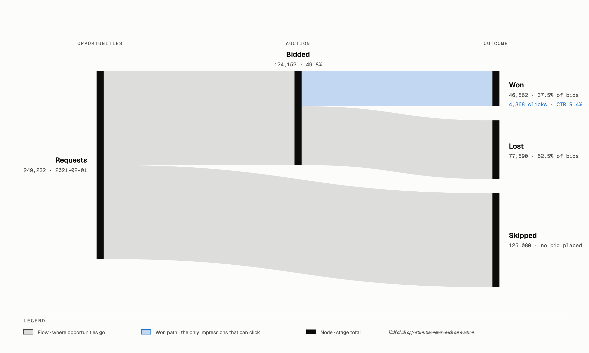

We bid on half of the opportunities, win 37.5% of the auctions we enter, and see a
click on 9.4% of the impressions we serve. That last number is the true
click-through rate; dividing clicks by all bids gives 3.5%, which is wrong because
every lost bid has `conversion = 0` by construction.

## Results in brief

| Question | Answer |
|---|---|
| 1. What is in the data? | One clean day of US traffic. Two columns are constant (`country`, `screen_orientation`). Missingness is structural: auction outcomes are null exactly where we did not bid, and device brand is null on desktop. Prices are heavy-tailed. Auction type splits the market in two: first-price is competitive (win 33% at a 1.4 CPM median), second-price is close to a monopoly (win 90% at 38 CPM). |
| 2. Which features predict a click? | Ranked by information value and mutual information on served impressions only, with auction outcomes excluded as leakage: `device_brand`, `device_type`, `session_depth`, `viewability`, plus light geographic and auction context. The biggest lift left on the table is a historical click rate per slot, and the CTR model confirms it. |
| 3. What bid wins X% of the time? | The win rate at a bid is the clearing-price CDF, so the bid that wins X% is the X-th quantile of the clearing price for that `url × ad_slot`. The median pair has two observations, so the quantiles are estimated with hierarchical shrinkage (`url`, `ad_slot`, `domain`, global, never crossing auction type). Back-tested on well-populated slots, a 50% target wins 50.5% of the time. |
| Beyond the brief | A gradient-boosted CTR model reaches AUC 0.78 with out-of-fold slot encodings against 0.69 without them. Quantile regression prices slots the lookup has never seen. A flat 10% bid shading would have saved 18% of first-price spend while keeping 88% of wins. 36 million hash guesses produced zero matches. |

## How the analysis works

### Q1. Characterisation

Beyond the usual schema and missingness pass, the useful finding is that the gaps
are not random. `bid`, `won_bid`, `feedback_bid` and `conversion` are missing on
exactly the 125,080 rows where `bidded == 0`, and `device_brand` is missing on
desktop because PC browsers do not report one. That is a signal to keep, not noise
to impute. The other structural fact is `auction_type`: first-price and second-price
auctions behave like two different markets, and every price-related result in the
repository is stratified by it.

### Q2. Feature selection

Clicks are rare (about 9% of served impressions), so raw correlation is a weak
screen. Categorical features are ranked by information value, built from weight of
evidence, which is the standard for rare binary outcomes in credit scoring. Numeric
features are ranked by mutual information. Two guards keep the answer honest: the
auction-outcome columns are excluded because they do not exist before the bid, and
CTR is computed only on won impressions because it is undefined on lost ones.

<table>
<tr>
<td width="50%">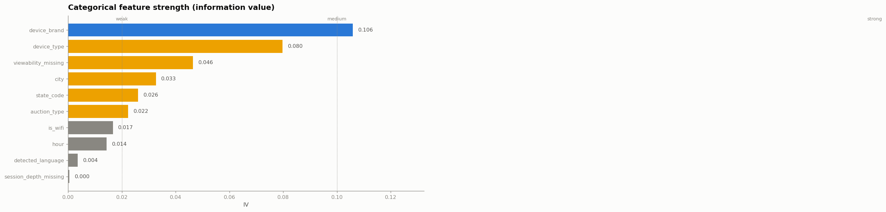</td>
<td width="50%">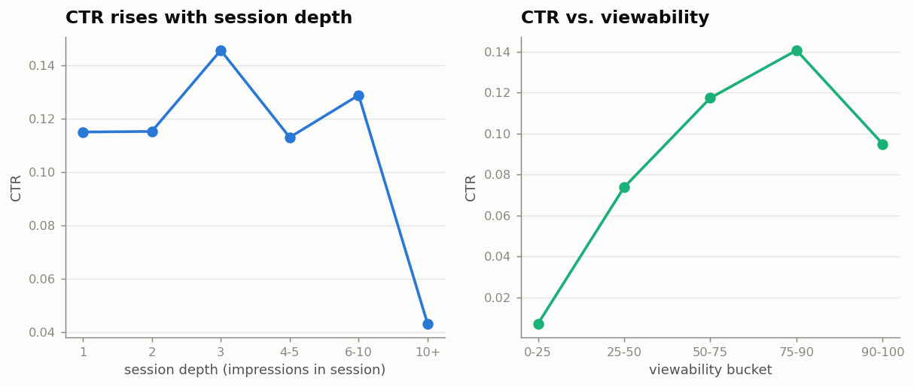</td>
</tr>
</table>

### Q3. The bid landscape

To win, a bid has to beat the market clearing price, so `P(win | bid) = F(bid)`
where `F` is the clearing-price CDF, and the bid that wins X% of the time is the
X-th quantile of the clearing price. `feedback_bid` is the clearing price under both
auction types (the winner's bid when we lost, the runner-up when we won). The
obstacle is sparsity: 13,817 `url × ad_slot` pairs, a median of two observations
each, and only 168 pairs with a hundred or more. Hierarchical partial pooling blends
the pair-level quantile toward the slot, the domain and the auction-type global
distribution, weighted by support (`n / (n + 30)`).

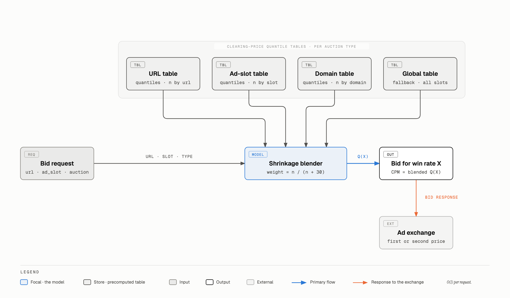

Serving is a table lookup per request, there is no online training, and slots with
no history fall back to broader priors. The back-test bids the model's price on
well-populated pairs and measures the realised win rate:

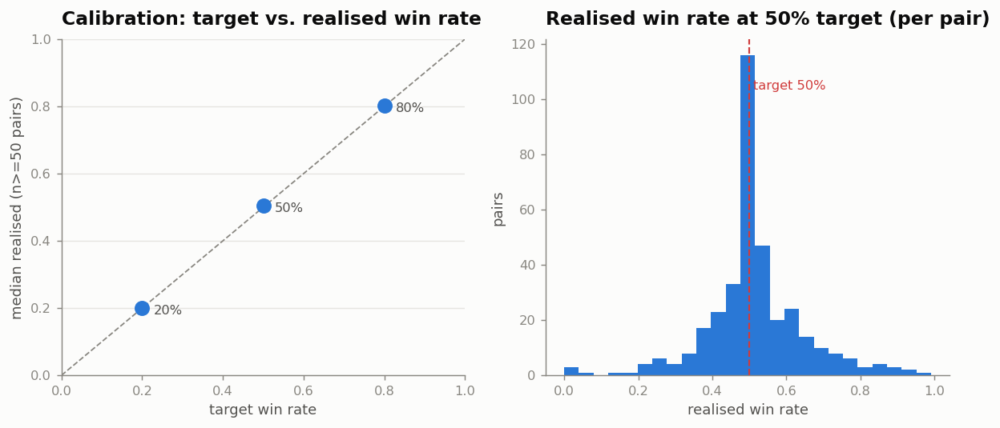

<p align="center">
  
</p>
<p align="center"><sub>Before exchanges had buildings, brokers priced securities by shouting on the curb. Photo: "The Curbstone Brokers" by dbking, <a href="https://creativecommons.org/licenses/by/2.0/">CC BY 2.0</a>.</sub></p>

## Beyond the brief

### Machine-learning models

Two models extend Q2 and Q3. A gradient-boosted CTR classifier, trained on served
impressions with five-fold cross-validation, reaches AUC 0.69 on the context
features alone and 0.78 once the hashed identifiers are added as out-of-fold
smoothed target encodings (average precision 0.17 to 0.26 against a 9.4% base
rate). Permutation importance puts viewability first, then the ad-slot and url
encodings; device brand, the Q2 leader, splits its credit with device type and
operating system. The model's reliability curve sits on the diagonal, which is what
matters when predicted CTR feeds a price.

A quantile regressor (pinball loss on log clearing price) is tested on 2,764
`url × ad_slot` pairs that never appear in training. It lands within a few points of
its targets (coverage 0.28, 0.54 and 0.80 for 0.2, 0.5 and 0.8) and beats the
hierarchical lookup on pinball loss at every quantile, because it can use the
request context where the lookup only has a domain or global fallback. The
recommended design keeps the lookup for slots with history and routes new pairs to
the regressor.

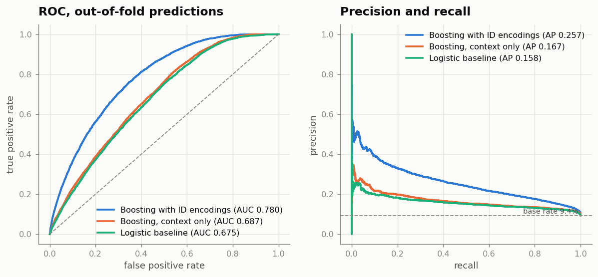

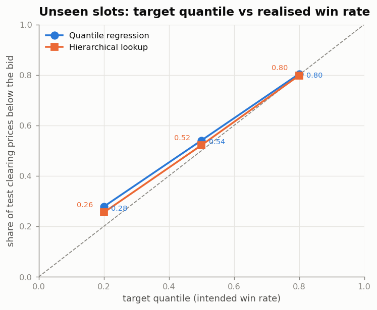

### Seven more layers

Each chart form was chosen with the Visual Vocabulary method (name the relationship
first, then pick the chart) and the reasoning sits next to each figure in the
notebook.

Bid shading is the largest lever in the file. In won first-price auctions the
median overpay is 41% of our bid, and four wins in ten paid more than double the
runner-up. A flat 10% cut would have kept 88% of wins and saved 18% of spend; the
ceiling with perfect knowledge of the runner-up is 47%.

Supply is concentrated. Fifty domains out of 8,635 carry half of all impressions
(Gini 0.92). Requests fall from 16,000 an hour in the US afternoon to 3,200 at
09 UTC, and the afternoon is also the most expensive hour to win. Android users
click on 14.1% of served impressions against 7.0% on Windows; Firefox is the lowest
browser at 5.7%. Cookie age is monotone after the first day, from 7.3% for cookies
under a day old to 10.5% for cookies older than a year. KMeans on behavioural
fingerprints sorts the 294 domains with at least 100 impressions into three
archetypes: 178 desktop publishers with deep sessions and a 6.9% CTR, 95 mobile
publishers at 12.9%, and 21 domains where 96% of auctions are second-price, the
median bid is 24 CPM and we win 88% of the time. A state tile map puts Maryland and Kentucky on
top at about 12% and Louisiana at the bottom at 6.5%, with thin states hatched.

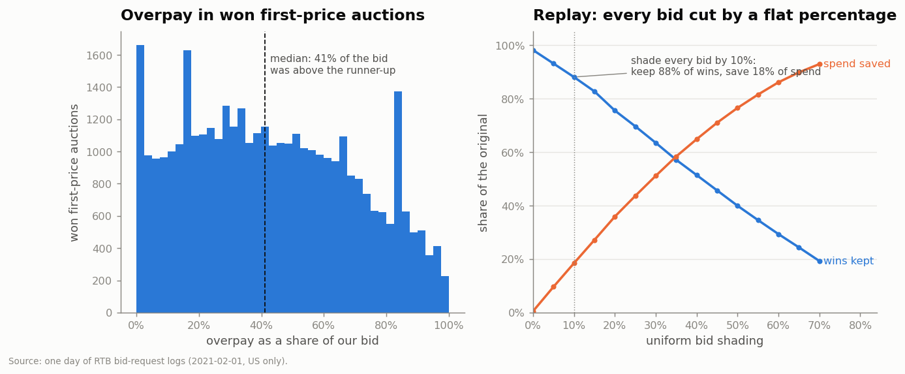

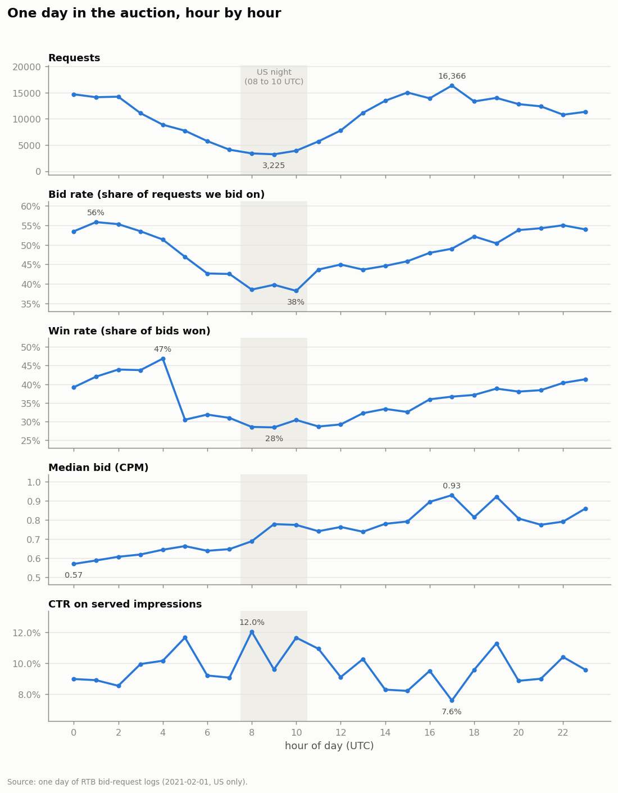

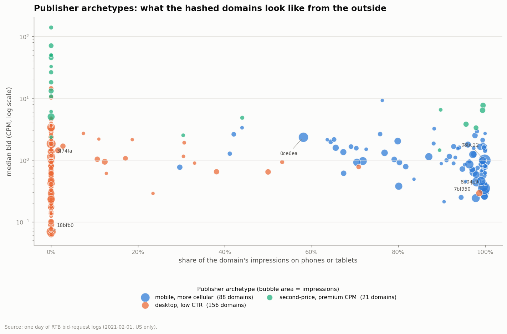

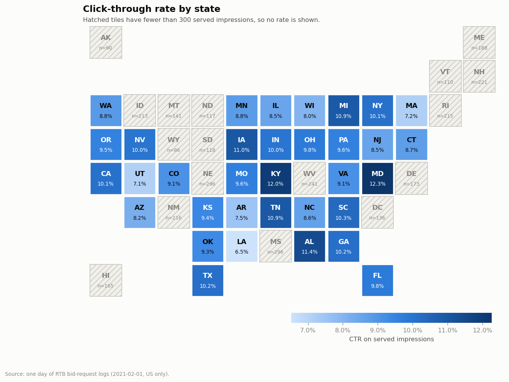

### Can the obfuscation be undone?

<p align="center">
  
</p>
<p align="center"><sub>Minified code reads to a machine and hides from a person, much like a salted hash. Photo by Markus Spiske on Pexels.</sub></p>

`domain`, `url`, `ad_slot` and `publisher_properties` are 32-character lowercase
hex strings with a flat first-digit distribution, which is what an MD5-style digest
looks like; `user_id` is a version 4 UUID and is unique on every row, so there is
one impression per user and nothing to learn from it. Three attacks were run.
Hashing the one million most popular domains under nine spellings with four digest
functions (36 million digests), hashing the integers 0 to 3,000,000 once and twice,
and hashing each column into the others all produced zero matches. The hashes are
salted or keyed, and no domain name can be recovered honestly from this file.

The structure survives anyway. Because equal inputs still give equal outputs, the
joins between columns are intact, and a functional-dependency matrix recovers the
hidden schema.

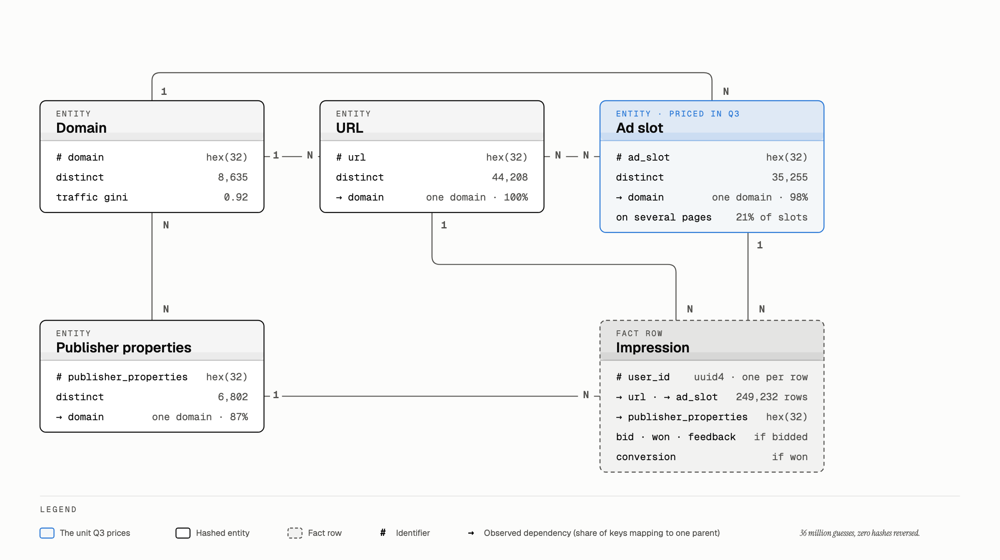

A page belongs to exactly one domain. An ad slot is a site-level placement reused
across pages (it fixes the domain 98% of the time, the page only 79%), which is why
the Q3 model pools by slot before it pools by domain. `publisher_properties` sits
above the domain and behaves like a seller or deal identifier rather than a site
attribute.

## Repository layout

```
.
├── notebooks/analysis.ipynb      executed narrative: Q1 to Q3, ML models, extra layers, decoding
├── build_notebook.py             regenerates the notebook from Python so the narrative is diffable
├── notebook_sections/            ml_models.py, layers.py, decode.py: the cells for the extra sections
├── src/
│   ├── data_loading.py           dtypes, UTC parsing, derived columns, clearing price
│   ├── profiling.py              Q1 tables: schema, constants, funnel, rate by category
│   ├── ctr_features.py           Q2: weight of evidence and information value, mutual information, leakage list
│   ├── bid_landscape.py          Q3: hierarchical quantile model and calibration back-test
│   ├── models.py                 CTR classifier, out-of-fold target encoding, quantile regression
│   ├── layers.py                 bid shading, hourly profile, concentration, user-agent parsing, cookie age, archetypes, states
│   ├── layer_plots.py            figures for layers.py, including the state tile grid
│   ├── decode.py                 hash forensics: format, functional dependencies, dictionary and integer attacks
│   └── viz_style.py              matplotlib style and the colour-vision-validated palette
├── scripts/
│   ├── run_models.py             fits the ML models; writes reports/metrics_models.json and figures (about 35 s)
│   └── run_layers.py             runs the layers and the decoding; writes reports/metrics_layers.json and figures (about 25 s)
├── reports/
│   ├── figures/                  every PNG used here and in the notebook, plus the diagram SVGs
│   ├── diagrams/                 the three hand-built diagrams as self-contained HTML with inline SVG
│   ├── images/                   the two CC-licensed photos and CREDITS.md
│   ├── findings.md               written summary of the results
│   └── metrics_*.json            the numbers behind the prose, machine readable
├── requirements.txt
└── CLAUDE.md                     guide for AI assistants working in this repository
```

## Reproduce it

```bash
python3 -m pip install -r requirements.txt

# The dataset is not committed (it belongs to the assignment's author and is 112 MB).
# Obtain data.csv from the assignment provider and place it here:
mkdir -p data && cp /path/to/data.csv data/data.csv

python3 build_notebook.py
python3 -m jupyter nbconvert --to notebook --execute --inplace notebooks/analysis.ipynb

# Optional: regenerate the metrics files and figures outside the notebook
python3 scripts/run_models.py
python3 scripts/run_layers.py
```

The dictionary attack in the decoding section needs the Tranco top-1M list at
`/tmp/top-1m.csv` (https://tranco-list.eu). Without it the cell says so and shows
the result recorded from the original run; everything else executes.

The `src/` functions work on their own:

```python
import data_loading as dl, bid_landscape as bl
df = dl.add_derived(dl.load_raw())
model = bl.HierarchicalQuantileModel().fit(dl.bidded_frame(df))
model.bid_for_winrate(some_row, target_winrate=0.75)   # CPM to bid
```

## Conventions behind the visuals

Chart types follow the Visual Vocabulary method: decide which relationship the
reader should see (distribution, change over time, part-to-whole, magnitude,
correlation, spatial, flow) and pick the chart from that family. Categorical hues
are assigned in a fixed order from a palette validated for colour-vision deficiency,
one axis per chart, sequential ramps in a single hue. The three diagrams are
hand-built SVG in `reports/diagrams/`: orthogonal connectors, masked labels, a legend
strip, one accent colour per diagram, and accessible `<title>` and `<desc>` elements.

## Notes

The dataset and the assignment brief are the property of the assignment's author
and are git-ignored. This repository ships the method, not the data.

Q2 is a feature analysis, as the brief asks; the CTR model in the extra section is
there to test the ranking, not to replace it. Q3's estimator is deployable as is.
Everything rests on one day of data, so there is no temporal holdout and prices are
assumed stable within the day.

Photo credits are in [`reports/images/CREDITS.md`](reports/images/CREDITS.md).
