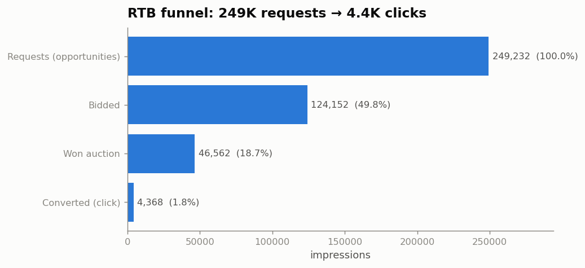

<div align="center">

# 🛰️ NSRB — Real-Time Bidding Impression Analysis

**Reverse-engineering the auction: what drives a click, and what it costs to win.**

*An end-to-end analysis of 249,232 real-time-bidding ad impressions — from data hygiene to a calibrated pre-bid pricing model.*


</div>

---

## TL;DR

A programmatic ad exchange auctions each ad slot in milliseconds. This project takes one
day of US bid-request logs and answers three questions a demand-side platform actually
cares about:

| # | Question | Headline result |
|:--:|---|---|
| **1** | What's in the data? | Funnel = **50% bid → 37.5% win → 9.4% CTR**; prices are heavy-tailed; **auction type splits the market in two**; two columns are dead constants. |
| **2** | Which features predict a click? | Leakage-safe, data-ranked core: **`device_brand`, `device_type`, `session_depth`, `viewability`** — biggest future lift is **historical-CTR aggregates**. |
| **3** | What bid wins X% of the time? | Win-rate = clearing-price CDF ⇒ **bid(X) = X-th quantile of clearing price** per slot, via **hierarchical shrinkage**. Back-tests **calibrated to target within ~1 point**. |

> **📓 The full narrative is [`notebooks/analysis.ipynb`](notebooks/analysis.ipynb)** — executed, with every figure and number reproduced from the raw data.

---

## The headline result: a calibrated bid model

The core deliverable of Q3 is a model that, given only a `url × ad_slot` and a target win
rate, returns the CPM to bid — *before* the auction. When back-tested on well-populated
slots, bidding the model's price wins almost exactly the target fraction of the time:


<table>
<tr>
<td width="50%">

**The RTB funnel**


</td>
<td width="50%">

**Feature strength (Information Value)**


</td>
</tr>
</table>

---

## How the analysis works (the interesting bits)

**Q1 — Characterisation.** Beyond the standard schema/missingness pass, the key insight is
that **missingness is structural**: the auction-outcome columns are null *exactly* where
we didn't bid, and device brand is null for desktop. That's signal, not noise. And
`auction_type` bifurcates everything — first-price is competitive (win ~33% @ ~1.4 CPM),
second-price is a near-monopoly (win ~90% @ ~38 CPM).

**Q2 — Feature selection.** Clicks are rare (~9%), so instead of raw correlation we rank
**categorical** features by **Information Value** (Weight-of-Evidence, the credit-scoring
standard for rare binary events) and **numeric** features by **mutual information**. Two
guards make the answer production-honest: exclude **leakage** (bid/won/feedback are unknown
pre-bid) and compute CTR **only on served impressions** (it's undefined on lost bids).

**Q3 — Bid landscape.** To win, your bid must beat the market **clearing price**, so
`P(win | bid) = CDF(clearing price)` and the bid to win X% is just the **X-th quantile of
the clearing price** for that slot. The obstacle is sparsity — the median slot has ~2
observations — solved with **hierarchical partial pooling** (`url → ad_slot → domain →
global`, never crossing auction type), which is why the back-test calibrates.

```
                       ┌─────────────────────────────────────────────┐
  request (url,slot) → │  look up finest level with support           │
                       │  blend quantiles by support (shrinkage)      │ → bid(X)
                       │  fall back: url → ad_slot → domain → global  │
                       └─────────────────────────────────────────────┘
```

---

## Repository layout

```
.
├── notebooks/
│   └── analysis.ipynb        # ← main deliverable: executed narrative + figures
├── src/                      # reusable, testable analysis library
│   ├── data_loading.py       #   schema hygiene, derived columns, clearing price
│   ├── profiling.py          #   Q1 — funnel, missingness, rate-by-category
│   ├── ctr_features.py       #   Q2 — WoE/IV, mutual information, leakage guards
│   ├── bid_landscape.py      #   Q3 — hierarchical quantile model + back-test
│   └── viz_style.py          #   validated colorblind-safe plotting style
├── reports/figures/          # exported PNGs (embedded above and in the notebook)
├── build_notebook.py         # regenerates the notebook (diffable narrative)
├── requirements.txt
└── CLAUDE.md                 # guide for AI assistants working in this repo
```

---

## Reproduce it

```bash
# 1. Install
python3 -m pip install -r requirements.txt

# 2. Get the data (not committed — it's the assignment's dataset, 112MB)
#    Obtain the CSV from the assignment provider and place it at data/data.csv
mkdir -p data && cp /path/to/data.csv data/data.csv

# 3. Run everything
python3 build_notebook.py           # regenerate the notebook
python3 -m jupyter nbconvert --to notebook --execute --inplace notebooks/analysis.ipynb
```

The `src/` functions are import-and-use:

```python
import data_loading as dl, bid_landscape as bl
df = dl.add_derived(dl.load_raw())
model = bl.HierarchicalQuantileModel().fit(dl.bidded_frame(df))
model.bid_for_winrate(some_row, target_winrate=0.75)   # → CPM to bid
```

---

## Notes & honesty

- **Data is not committed.** The dataset and the assignment brief are the property of the
  assignment's author and are intentionally `.gitignore`d; this repo ships the *method*,
  not the data.
- **Scope.** Q2 is a feature *analysis*, per the brief — not a trained CTR model. Q3's
  estimator is deployable as-is; the notebook documents how to extend it with survival
  analysis (for censoring) and quantile regression (for cold-start slots).
- Colors are validated colorblind-safe (CVD ΔE ≥ 8) via a design-system palette.
